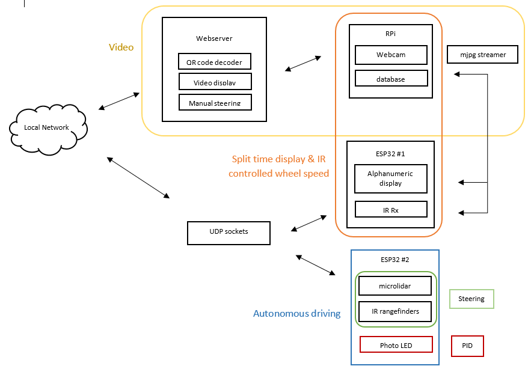

#  Navigation

Author: Team skill, 2019-12-10

## Summary

This skill shows the overall program design for quest 6. A system flow chart is made and attached below. It is a cleaned up version of the diagram drawn in class.  

## Sketches and Photos

## Modules, Tools, Source Used in Solution

The flow chart lists out the various hardware and software components used in this quest. The communication between each elements are shown through double sided arrows, and some major tasks are color coded for better visualization. ESP32 and RPi boards generally transmit data through UDP sockets on a local network supported by the configured router. Sensors are separated into two groups and connected to separate ESP32 boards. Webcam is connected to the RPi and the livestream video is display on the localhost with webserver. RPi decodes QR code that is captured by the webcam and also save the beacon ID obtained from the IR receiver along with the split time to a database. Range sensors are used for autonomous driving to control steering and wheel speed through simple logic and PID. The sensor that goes in the front also act as a collision sensor that stops the ESC motor when triggered. The ESP32 that connects the IR receiver and alphanumeric display access the RPi database to display the split time and also control the ESC motor based on the IR message received. Lastly, Manual driving is controlled through webserver with keyboard and the input triggers Jquery to send data through the UDP sockets to an ESP32 and control steering and wheel speed.

## Supporting Artifacts

-----

## Reminders
- Repo is private
