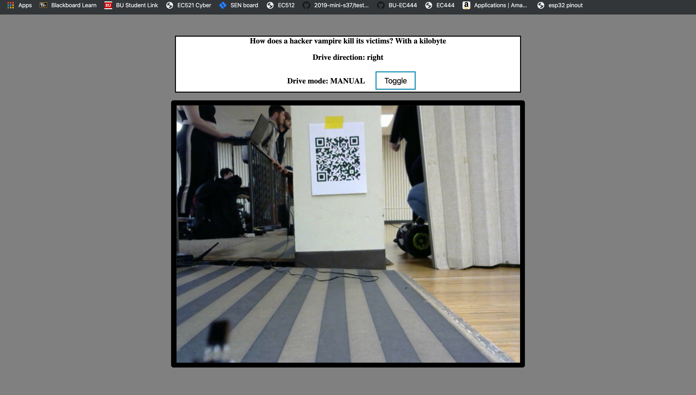

# Quest 6, Rollup – Capture the Flag Crawler-Style
Authors: Chase Clarke, Megan Heydari, Leila Lee

2019-12-09

## Summary

This quest builds on top of quest 4 so that the previous autonomously navigating crawler could now stop and start itself based on IR signals sent by beacons and is also capable of being controlled manually through web interface. A webcam is also attached to the crawler for livestreaming video and decoding QR code through the web server. The webcam allows the user to navigate the crawler through keyboard presses on the web client.

## Evaluation Criteria

### Web interface including
 - For steering and controlling car speed and direction
    - Steering could be controlled through the webserver by pressing on the predefined keys on the keyboard - 'w', 'a', 's', and 'd'. A Jquery function would be called and signal would be sent through UDP sockets to communicate with ESP32.
 - Showing current and past “splits” recorded on the course by your crawler and written to the RPi database
    - The webserver access the RPi database to fetch the stored beacon ID and split time and pass them to ESP32 for the alphanumeric display.
 - Live streaming video coming from a webcam on the RPi on the crawler
    - Webserver communicate with the RPi to receive the video stream and display on localhost.

### Crawler including
 - Range sensors for tracking wall & Collision sensor on front
    - The crawler is equipped with 2 IR rangefinders on the left side and an microlidar in the front.
 - PID control on set-point speed (forward direction, not required for reverse)
    - The PID control module uses proportional, integral, differential calculations to calculate an "error" value and uses it to adjust speed. If the PID did not generate a large enough error to reach the target speed, it will take into account the previous error and generate a larger error. The Kp, Kd, and Ki values are adjusted through experimentations in order to get the crawler to speed up and slow down as smoothly and efficiently as possible.
 - IR receiver
    - The receiver diode interprets the infrared pulse emitted by the IR LED. Internally, the receiver diode filters out the 38 kHz carrier signal, relays the resulting data to RPi.
    - Steering can be controlled through the webserver by pressing on the predefined keys on the keyboard - 'w', 'a', 's', and 'd'. A Jquery function would be called and signal would be sent through UDP sockets to communicate with ESP32.
    
 - Showing current and past “splits” recorded on the course by your crawler and written to the RPi database
    - The webserver access the RPi database to fetch the stored beacon ID and split time and pass them to ESP32 for the alphanumeric display. In our live demonstration, we had some trouble displaying the split times on the alphanumeric display because we had some issues configuring the i2c. We resolved these issues and were able to print split times on the display later on. 
    
 - Live streaming video coming from a webcam on the RPi on the crawler
    - The webserver communicates with the RPi to receive the video stream and display it on the localhost.

### Crawler including
 - Range sensors for tracking wall & Collision sensor on front
    - The crawler is equipped with 2 IR rangefinders on the left side and a microlidar in the front. These sensors are how the crawler performs collision detection, wall following, and turning.
    
 - PID control on set-point speed (forward direction, not required for reverse)
    - The PID control module uses proportional, integral, differential calculations to calculate an "error" value and uses it to adjust speed. If the PID did not generate a large enough error to reach the target speed, it will take into account the previous error and generate a larger error. The Kp, Kd, and Ki values are adjusted through experimentations in order to get the crawler to speed up and slow down as smoothly and efficiently as possible.
    
 - IR receiver
    - The receiver diode interprets the infrared pulse emitted by the IR LED. Internally, the receiver diode filters out the 38 kHz carrier signal, relays the resulting data to RPi.
    
 - Alpha display showing most recent split (time)
    - uses i2c display
    - receives a split time from the hub in the form of an integer and displays it for the duration of the split

### New functions
 - Web streaming from RPi on vehicle
   - The RPi is connected to a web cam that is configured to stream a video using Mjpg streamer. The stream can be viewed via a url address and snapshots can be taken to pull the most recent frame from the stream. Snapshots are taken from the stream and used as input for the QR code reader.

  

 

 - Left and right turns at corners – follow walls
    - Autonomous: The front-facing microlidar monitors objects/walls that could be in front of it. Once it comes within a certain distance of a wall, our algorithm check the proximity of the wall the crawler is crawling in parallel with. If the parallel wall is present and a wall is detected in front, the crawler will turn its wheels for a calculated duration of time in order to turn right a full 90 degrees. The duration of time is something we determined empirically through trial and error.
    - User Controlled: The user watches the live stream of the crawler via the web cam on the web client. The key presses of 'w', 'a', 's', and 'd' are programmed to trigger a Jquery function that uses sockets.io to pass the button value (Front, Left, Reverse, Right, respectively) to the server side. Then the server uses UDP sockets to send the signal to the ESP. Multiple presses on the same 'left' or 'right' key indicates a 90 degree turn, while a single key press in either direction indicates a 45 degree turn. Both of these degree amounts were determined through trial and error.

 - Left and right turns at corners – follow walls
    - Autonomous: The front-facing microlidar monitors objects/walls that could be in front of it. Once it comes within a certain distance of a wall, our algorithm checks the proximity of the wall the crawler is crawling in parallel with. If the parallel wall is present and a wall is detected in front, the crawler will turn its wheels for a calculated duration of time in order to turn right a full 90 degrees. The duration of time is something we determined empirically through trial and error.
    - User Controlled: The user watches the live stream of the crawler via the web cam on the web client. The key presses of 'w', 'a', 's', and 'd' are programmed to trigger a Jquery function that uses sockets.io to pass the button value (Front, Left, Reverse, Right, respectively) to the server side. Then the server uses UDP sockets to send the signal to the ESP. Multiple presses on the same 'left' or 'right' key indicates a 90 degree turn, while a single key press in either direction indicates a 45 degree turn. Both of these degree amounts were determined through trial and error.

 - Triggered start and stop signals based on signal from beacon (green–go, red–stop, yellow–slow down)
   - The crawler is equipped with an IR receiver that reads the signal coming from each beacon. An ESP32 receives the input from the IR receiver and is programmed to interpret the Green, Yellow, and Red signals. The ESP32 sends a signal to the ESC motor accordingly, telling it to stop or start.

 - Record split time when reach each beacon
   - Each time the crawler reaches a beacon, the hub reads the signal and obtains information about the beacon ID. The beacon IDs are stored in a database along with the time. This is similar to the "check in" concept of the key fob. The split time is determined by querying the database for the time at the previous beacon and compares it to the time at the present beacon. This is the split time that will be displayed on the alphanumeric display.

 - Remote driving when reach last beacon
   - Remote driving is an option that can be selected via a button press on the web client. The button press sends a signal to the sever that relays the information the ESP32. The result is that the ESP32 will go into a remote driving mode which then interprets the signals received in the form of key presses from the web client.

 - Decode QR code
   - The QR code is read using Zbar image reader. The user watches the live video stream and once the crawler pulls up to a QR code and has the code in the web cam frame, the user clicks the snapshot button. This will save a snapshot of the most recent frame as a .jpg. This .jpg is used as the input to Zbar image reader which decodes the QR code. The result of the QR code decoding is displayed on the console.

- PID speed control
  - We use the photo sensor and pinwheel pair on the back wheel of our crawler. We monitor the speed using the white pulses on the pinwheel and use these are input to our PID function. We adjust the coefficients in the PID function to give out car a nice result of going around 0.4 mph. The car self corrects as it accelerates and eventually reaches the correct speed.

  - We use the photo sensor and pinwheel pair on the back wheel of our crawler. We monitor the speed using the white pulses on the pinwheel and use these are input to our PID function. We adjust the coefficients in the PID function to give our car a nice constant speed. The car self corrects as it accelerates and eventually reaches the correct speed.

## Solution Design
Ultimately, our design used 2 ESP32s to separate the steering/driving from the hub/display. One ESP32 received data from the IR receiver and interpreted signals from the beacons. This ESP32 also communicated with the webserver by sending split times and displaying them on the alphanumeric display. We had some issues with the display as we struggled to initialize the i2c display without first flashing previous i2c code. Unfortunately we were not able to resolve this issue in time for the demo on Tuesday, but were able to get things working while the ESP32 was plugged into one of our laptops.The other ESP32 received data from the 2 IR rangefinders on the left side of the crawler and the one micro lidar on the front. This ESP32 was in charge of steering and driving as well as accepting manual driving commands from the webserver. 

## Skills

### Webcam

#### Summary
The purpose of this skill was to get the webcam up and running for the sake of the quest. We SSHd into our rapsberry pi and plugged the webcam into the data input port of the Pi. Then to get the webcam functioning we used MJPG streamer to send out stream to be accessed on a port on the network.

Once this was complete, we used the port address to add the video stream to our web client. We went on to use this to read QR codes.

#### Sketches and Photos

#### Modules, Tools, Source Used in Solution
Webcam, Raspberry Pi

#### Supporting Artifacts
[MJPG Streamer](https://wouterdeschuyter.be/blog/how-to-create-a-15-dollar-web-controllable-camera-with-a-raspberry-pi-zero)

### Navigation

Once this was complete, we used the port address to add the video stream to our web client. We went on to use this to read QR codes.

### Navigation

  

## Sketches and Photos

  

 

## Supporting Artifacts and Video Demonstration
- [Link to repo](https://github.com/BU-EC444/Team8-Clarke-Heydari-Lee/tree/master/quest-6/code)
- 

## References
[Z bar image reader](http://tuxthink.blogspot.com/2014/01/qr-code-encode-and-decode-qr-code-on.html)

[MJPG Streamer](https://wouterdeschuyter.be/blog/how-to-create-a-15-dollar-web-controllable-camera-with-a-raspberry-pi-zero)

-----

## Reminders

- Video recording in landscape not to exceed 90s
- Each team member appears in video
- Make sure video permission is set accessible to the instructors
- Repo is private
